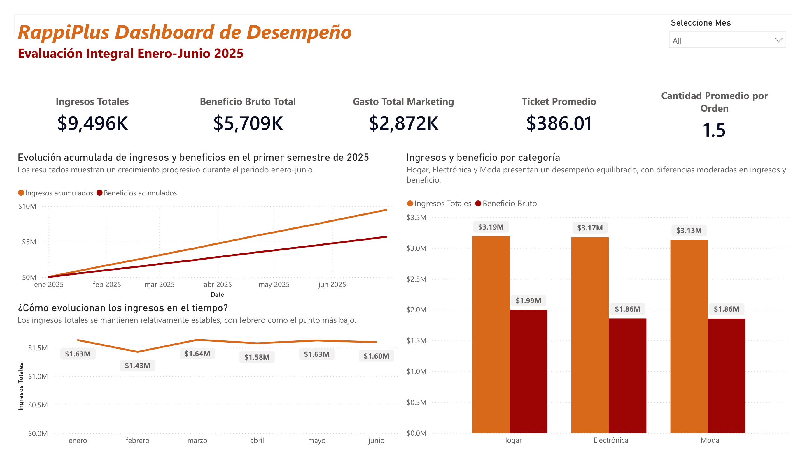
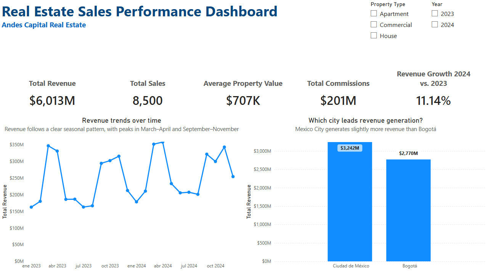

# Hi, I'm Edgar 👋

Data Analyst · Business Analytics · Cancún, México

I use data to analyze performance, identify patterns, report insights through dashboards and support better decision-making with tools such as SQL, Python, Excel, and Power BI.

Currently building my expertise in data analytics while combining my business and operational background with my interest in taking on new challenges, understanding them, and developing solutions.

---

### 🧭 **About Me**

- ⚡ Data Analyst driven by curiosity and problem-solving.
- 📊 Enjoy turning complex information into clear and actionable insights.
- ⚙️ Focused on using automation to improve efficiency.
- 💬 Open to connecting and exchanging ideas about data and interesting challenges.

---

### 🛠️ **Tech Stack**

#### Programming

#### Data Analysis and Query

#### Data Visualization

#### Tools & Environment

---

### 📌 **Projects**

---

#### 📈 **RappiPlus Business Performance Analysis**

> Analyzed RappiPlus business performance and identified the main opportunities for improving profitability, conversion, and user retention.

  

**Tools:**

**Check this project out with the link bellow:**

---

#### 🏠 **Real Estate Sales Performance Dashboard**

> Analyzed 8,500 real estate transactions to identify the main drivers of sales value across markets, property types, customer segments, and sales channels.

  

**Tools:**

**Check this project out with the link bellow:**

---

### 🔗 **Contact**

> Explore more projects in my repositories, connect with me on LinkedIn, or reach out directly!

